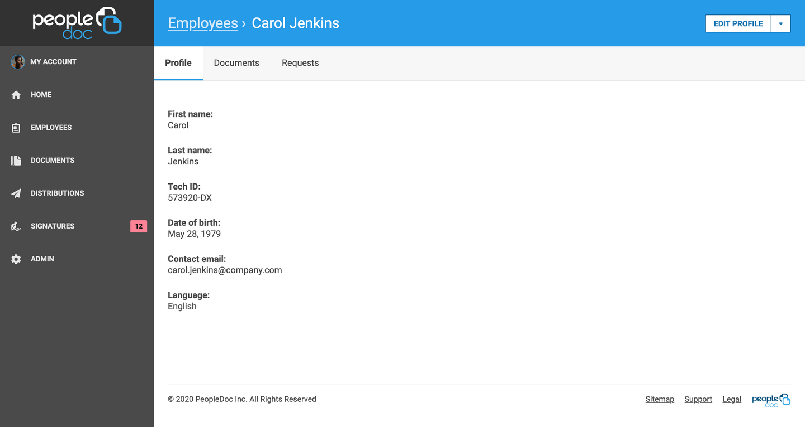
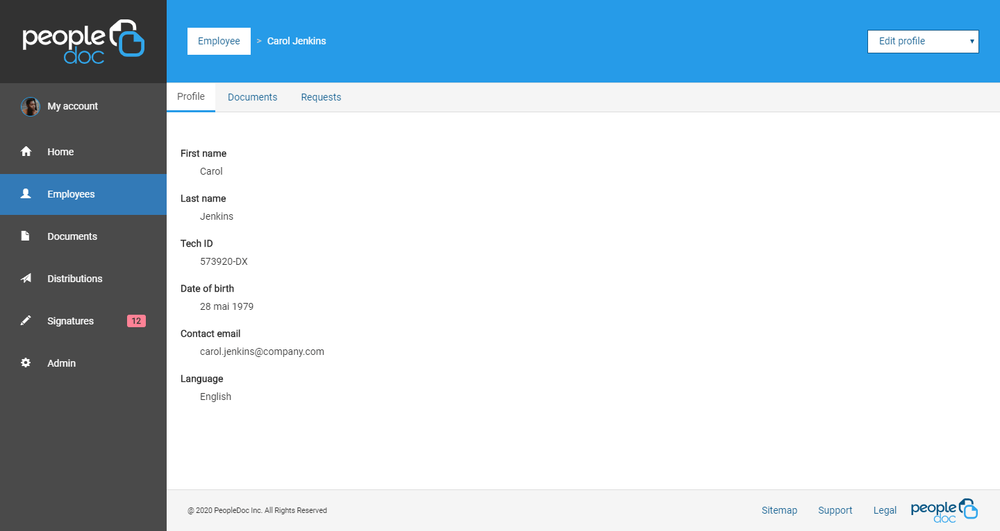

# people-doc-exercise

Coding exercise for [PeopleDoc](https://www.people-doc.com/) recruitment.

|  |  |
| --- | --- |

## Thinking process

 - The documentation description first focus on reusability. I'll need to identify recurring component in the page.
 Also, this means building or using a CSS framework. I think I'll use [BootstrapCSS](https://getbootstrap.com/) as it will allow me to build faster at the cost of visual identity.
 - Secondly, CSS structure and naming are mentioned. In my opinion, it's better to stick with what's already used in a project.
 But, starting from scratch, I'll use a component + modifier syntax (`.<component>-<modifier>`) to align with BootstrapCSS.
 - The last point is semantic and accessibility. This will force me to **not** use an existing component library or find one focused on accessibility.
 Doing it myself will be easier for this exercise, but will slow down the work process.

## Setup

 - First I create an new Github repository and `checkout` it.
 - Then, I init a new `NPM` project to access all the tools I know:
    - Webpack
    - BootstrapCSS
    - SCSS
 - Next, I start to lay the directory structure of the project and the first files.

## Tooling

 - Webpack: Build and bundle all sources.
    - Babel: Transpile Javascript to a more compatible version using browser usage.
    - html-webpack-plugin: create a HTML file and inject build source into it.
    - mini-css-extract-plugin: create a separate file for all the CSS.
 - BootstrapCSS: CSS framework for easier component creation and page responsiveness.
    - SCSS: CSS preprocessor
    - PostCSS: CSS postprocessor
        - autoprefixer: Add browser specific prefixes when needed
        - purgeCSS: Remove unused CSS properties
 - Now: Quickly and easily deploy online without configuration.
 - LightHouse: Check "performance", "accessibility" and "best practices" of a page.

## Decision

A few decision that I made concerning the design, these are my personal opinions and are here only because this is an exercise.

 - I used the glyph coming from BootstrapCSS instead of the ones given.
 This is only because it's easier to work with glyphs than SVG and it save some space.
 - I avoid putting all link in the left navigation-bar in upper-case and bold for better readability.
 - I added a solid background to the breadcrumb link for better contrast with the back.
 - I used native select tag for the drop-down.
 This greatly increase accessibility and reduce code complexity for the low cost of using the default appearance.
 - I removed colon at the end of fields titles to declutter a little the page.
 - I used the same style for all links. In the original design, links were sometimes underscored and sometimes not.
